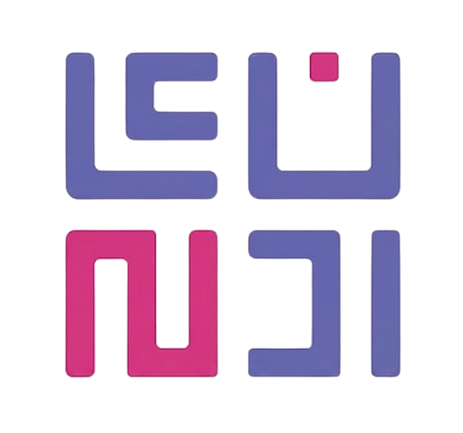

  
  
  <h1>🌌 EunjiX Repository 🌌</h1>
  
<strong>A Next-Generation, Cyberpunk-Themed Custom ROM & Kernel Download Center.</strong>

  
  
  
  
  

---

## ⚡ The Vision
**EunjiX** is not just another standard download directory. It is a cutting-edge Front-End masterpiece tailored specifically for the Android Open Source Project (AOSP) community. Built entirely from scratch with zero heavy frameworks, it delivers buttery-smooth 60fps scrolling, an aggressive Cyberpunk aesthetic, and is powered by an advanced Serverless architecture.

This project redefines how a ROM Repository should operate: **Fast, Elegant, and Intelligent.**

---

## 🔥 The Arsenal (Key Features)

* 👾 **Cyberpunk UI/UX:** Features hardware-accelerated Matrix Scanlines, interactive cards with rotating laser edges, and a hacker-style terminal search input.
* ⚡ **Zero-Framework Architecture:** Pure HTML5, CSS3, and Vanilla JavaScript. No React, no Vue—ensuring sub-second load times and maximum battery efficiency.
* 📱 **PWA (Progressive Web App):** Installable directly to Android/PC home screens with an intelligent offline-first Service Worker and manual cache management.
* 🌐 **Instant i18n System:** Seamless bilingual translation (English ↔ Indonesian) executed entirely on the client-side with zero page reloads.
* 🔎 **Dynamic Filter & Sort:** A lightning-fast search engine that filters through ROM/Kernel types, device codenames, and dynamically sorts payload sizes in real-time.
* 🔗 **Serverless Deep-Linking:** Utilizes Vercel Edge Functions (`api/share.js`) to intercept social media crawlers (Telegram/WhatsApp), dynamically generating Open Graph (OG) Meta Tags for individual ROMs while seamlessly redirecting human traffic.

---

## 🛠️ Technology Stack

| Component | Technology / Tools |
| :--- | :--- |
| **Front-End** | Vanilla JavaScript, HTML5, CSS3 |
| **Back-End (API)** | Node.js (Vercel Serverless Functions) |
| **Database** | Local JSON Engine (`data.json`) |
| **Hosting & CI/CD** | Vercel Edge Network |
| **Assets & Typography**| FontAwesome 6, Google Fonts (Roboto & Monospace) |

---

## ⚙️ How Serverless Deep-Linking Works
This project bypasses the typical constraints of Client-Side Rendering (CSR) by implementing a custom API Gateway:
1. When a ROM link is shared (`/api/share?id=...`), the Serverless Gateway intercepts social media web crawlers.
2. The server parses the local `data.json` and injects specific ROM details (Title, Size, Device, Maintainer) into the HTTP response.
3. When clicked by a human user, a client-side script seamlessly redirects the browser to the exact DOM element via hash routing.
---

  
Forged with ☕ and late-night code.

